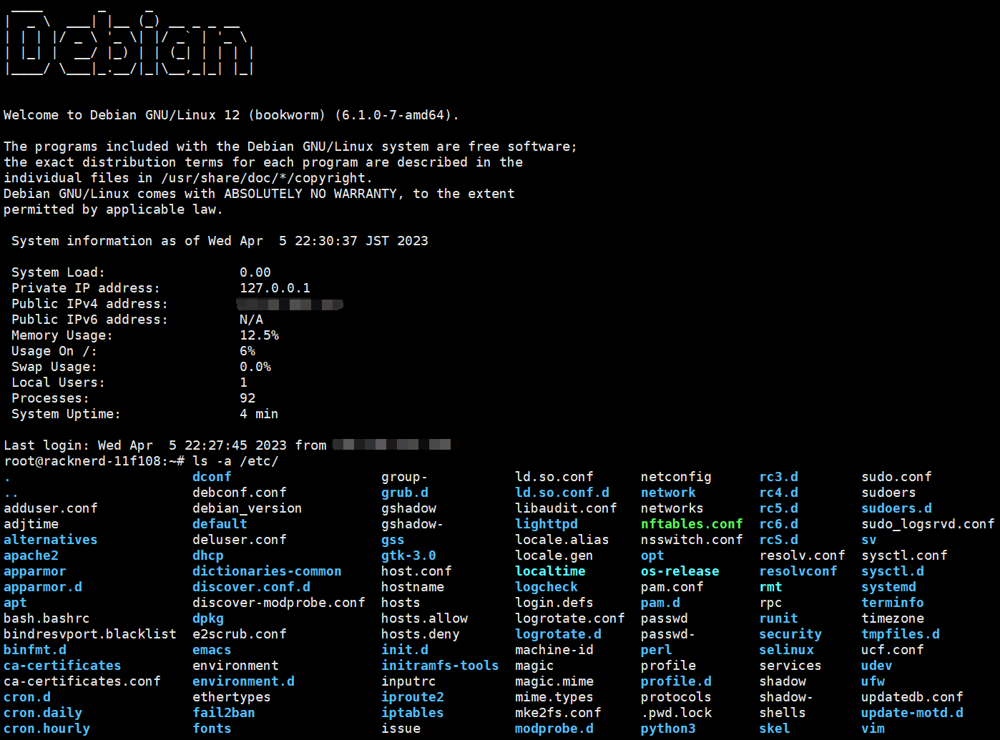

# Tools
Something about scripts
# Linux reinstall useage
## Features and updates:
- "InstallNET.sh" will give you a clean, safe, official Linux system, and help you escape of your server providers' monitoring.
- The operation is easy, several minutes installation will be complated.
- Support install to Debian 8+, Ubuntu 14.04~20.04, Redhat series(including CentOS 7+, Almalinux 8+, Rockylinux 9+, Fedora 34+).
- Can also run in mainline version of other redhat series(Oracle Linux, VzLinux) to install supported system.
- Support major cloud providers, especially support Oracle Cloud ARM machine.
- Detect the CPU architecture of current os automatically, you need not to add parameter '-v' to comfirm architecture manually.
- Can handle boot item automatically of grub2 in different hardware platforms(AMD64 legacy/AMD64 UEFI/ARM64 UEFI) to make sure all supported bootfile can be loaded correctly.
- Support install from Linux to Windows. details refer to "How to install Windows?" section.
- Support single-stack(only have IPv6 public address) server like Vultr 2.5$/mo model, only for DHCP.
- Support network auto configurations in bio-stack(have both IPv4 and IPv6 public address), after log into system, you don't have to config IPv6 address manually, only for Debian, DHCP.
- You can modify architecture, mirror, firmware, ssh port, password etc. 
- Friendly to low memory machine, for debian series, recommend RAM is above 512MB, for redhat series, recommend RAM is above 2GB.</b>
- Ubuntu 22.04 has cancelled net boot start features, so this program don't support Ubuntu 22.04 and above reinstallation(source: https://www.reddit.com/r/Ubuntu/comments/uroape/is_there_a_netbootiso_equivalent_for_2204_jammy/).
- South Korea debian official mirror(http://ftp.kr.debian.org/debian/) is usually crashed down, so I change recommend mirror for Jaist University to replace it. Japan recommend debian mirror is from https://www.riken.jp/, a science research organization in Japan. America recommend debian mirror is from University of California, Berkeley: https://www.berkeley.edu/.
- Completely  modified debian, such as support terminal files colorful displaying, permanently change dns server, disable expired certificates, add on a cute welcome introduction, pre-install many complements in preseeding progress, now enjoy a newly, comfortable, graceful debian experience!
- Support grub2 boot file modify, it can switch debian to Redhat or switch Redhat to debian smoothly, in old version if you installed from debian to redhat, you will no more switch to debian.
- Support xfs file system(only for Debian 9 and later), it's better than the old ext2 and it's the default option of redhat series.
- Detect if the machine is operating in mainland of China or outside and switch mirror automatically.
- Support the parameter of '-port' to modify ssh port of redhat series.
- Detect the network of machine is DHCP or static automatically.

- Change name server for Debian permanently is provided by "resolvconf", related configuration files has been written. you just need to logging in new installed system, and install "resolvconf":
<pre><code>echo "O" | apt install resolvconf -y</code></pre>
to make changes validating!

## Defects:
- Don't support Ubuntu 22.04(jammy) and later, because Canonical deprecated netboot file and force users to use its fuckin cloud-init, it must virtualization demanded but most of VPS can't support.
- For redhat series 8, the minimum memory requirement is 2.5GB, for redhat series 9, the minimum memory requirement is 2GB.
- Because the syntax of grub1 in CentOS 6 is different from other version of grub1 or grub2 completely, so I removed support to CentOS6 or Oracle Linux 6.

## Download:
<pre><code>wget --no-check-certificate -qO InstallNET.sh 'https://raw.githubusercontent.com/leitbogioro/Tools/master/Linux_reinstall/InstallNET.sh' && chmod a+x InstallNET.sh</code></pre>

## Dependences:
Debian series(Debian/Ubuntu):
<pre><code>apt update -y</code></pre>
<pre><code>apt install xz-utils dnsutils wget file efibootmgr -y</code></pre>
Redhat series(CentOS/Almalinux/Rockylinux/Oraclelinux/Fedora):
<pre><code>yum update --allowerasing -y</code></pre>
<pre><code>yum install xz dnsutils wget file efibootmgr -y</code></pre>

## Quickly start
If you need to add other parameters, version number must be assigned!
### Debian 11
<pre><code>bash InstallNET.sh -debian</code></pre>
### CentOS 9 stream
<pre><code>bash InstallNET.sh -centos</code></pre>
### Almalinux 9
<pre><code>bash InstallNET.sh -almalinux</code></pre>
### RockyLinux 9
<pre><code>bash InstallNET.sh -rockylinux</code></pre>
### Fedora 37
<pre><code>bash InstallNET.sh -fedora</code></pre>
### Ubuntu 20.04
<pre><code>bash InstallNET.sh -ubuntu</code></pre>

## Fully useage sample
<pre><code>bash InstallNET.sh -debian/ubuntu/centos/almalinux/rockylinux/fedora(os type) 11(os version) -v 64(os bit) -port "your server port" -pwd "your server password" -a(auto install)/m(manually in VNC) -mirror "a valid url for OS image source" --dhcp-static --ip-addr 'x.x.x.x'(ip address) --ip-mask 'x.x.x.x'(subnet mask) --ip-gate 'x.x.x.x'(gateway) -firmware(with hardware drivers)</code></pre>

## Parameters Descriptions
**-debian 9/10/11** : Debian 9 and later
 
 

**-centos 7/8/9**: CentOS 7 and later
 
 

**-almalinux/alma 8/9**: AlmaLinux 8 and later
 
 

**-rockylinux/rocky 8/9**: RockyLinux 8 and later
 
 

**-fedora 34/35/36/37**: Fedora 34 and later
 
 

**-ubuntu 16.04/18.04/20.04**: Ubuntu from 16.04 to 20.04
 
 

**-mirror**: OS install files resource, you can select one which nearest for actual location of your server to upspeed installation.
 
 

For Debian, official recommend mirror lists are here:
 
<pre><code>https://www.debian.org/mirror/list.html</code></pre>
 

For CentOS, official recommend mirror lists are here:
 
<pre><code>https://www.centos.org/download/mirrors/</code></pre>
 

For Almalinux, official recommend mirror lists are here:
 
<pre><code>https://mirrors.almalinux.org/</code></pre>
 

For RockyLinux, official recommend mirror lists are here:
 
<pre><code>https://mirrors.rockylinux.org/mirrormanager/mirrors</code></pre>
 

For Fedora, official recommend mirror lists are here:
 
<pre><code>https://admin.fedoraproject.org/mirrormanager/mirrors/Fedora</code></pre>
 

For Ubuntu, official recommend mirror lists are here:
 
<pre><code>https://launchpad.net/ubuntu/+cdmirrors</code></pre>
 

**-port**: you can pre-specify ssh port of system, range is 1~65535, **default is '22'**.
 
 

**-pwd**: you can pre-specify ssh password of system, **default is 'LeitboGi0ro'**.
 
 

**--ip-addr**: if your cloud provider is from GCP etc, you should input it manually.
 
 

**--ip-gate**: if your cloud provider is from GCP etc, you should input it manually.
 
 

**--ip-mask**: if your cloud provider is from GCP etc, you should input it manually.
 
 

**-firmware: specify drivers for Debian to support old hardwares, if your server location is in mainland China, you can prefer it to mirror of 'University of Science and Technology of China(https://mirrors.ustc.edu.cn/debian-cdimage/)' for downloading more quickly, default mirror is from http://cdimage.debian.org/cdimage/.
 
 

**32/i386 or 64/amd64 or arm/arm64**: OS bit
If you don't know, don't assign it!
 
 

### Advanced usage, for example Debian 11 (recommend for servers which are locating outside of mainland China)
Japan:
 
<pre><code>bash InstallNET.sh -debian 11 -mirror "http://ftp.riken.jp/Linux/debian/debian/"</code></pre>
HongKong:
 
 
<pre><code>bash InstallNET.sh -debian 11 -mirror "http://ftp.hk.debian.org/debian/"</code></pre>
Singapore:
 
 
<pre><code>bash InstallNET.sh -debian 11 -mirror "http://ftp.sg.debian.org/debian/"</code></pre>
South Korea:
 
<pre><code>bash InstallNET.sh -debian 11 -mirror "https://ftp.jaist.ac.jp/pub/Linux/debian/"</code></pre>
Taiwan:
 
 
<pre><code>bash InstallNET.sh -debian 11 -mirror "http://ftp.tw.debian.org/debian/"</code></pre>
America:
 
 
<pre><code>bash InstallNET.sh -debian 11 -mirror "https://mirrors.ocf.berkeley.edu/debian/"</code></pre>
Canada:
 
 
<pre><code>bash InstallNET.sh -debian 11 -mirror "http://ftp.ca.debian.org/debian/" -firmware</code></pre>
British:
 
 
<pre><code>bash InstallNET.sh -debian 11 -mirror "http://ftp.uk.debian.org/debian/" -firmware</code></pre>
Germany:
 
 
<pre><code>bash InstallNET.sh -debian 11 -mirror "http://ftp.de.debian.org/debian/" -firmware</code></pre>
France:
 
 
<pre><code>bash InstallNET.sh -debian 11 -mirror "http://ftp.fr.debian.org/debian/" -firmware</code></pre>
Russia:
 
 
<pre><code>bash InstallNET.sh -debian 11 -mirror "http://ftp.ru.debian.org/debian/" -firmware</code></pre>
Australia:
 
 
<pre><code>bash InstallNET.sh -debian 11 -mirror "http://ftp.au.debian.org/debian/" -firmware</code></pre>

## Default Configurations
### Time zone
Asia Shanghai
### Time zone
Asia Tokyo
### Default User name
root
### Default Password
LeitboGi0ro
### Default Port
22
 
 
<b>If you didn't assign other ssh password or port, after system installation, you must change passwords immediately if you assigned default password(LeitboGi0ro)!</b>
 
 

## How to install Windows?
Notice: Microsoft products and services—including images, text, and software downloads (the "content")—are owned either by Microsoft Corporation or by third parties who have granted Microsoft permission to use the content. Microsoft cannot grant you permission for content that is owned by third parties. You may only copy, modify, distribute, display, license, or sell the content if you are granted explicit permission within the End-User License Agreement (EULA) or license terms that accompany the content or are provided in the following guidelines. For more information, consult your copyright attorney.
 
 
<b>"installNET.sh" doesn't provide any third-part activation service for Windows, this function is only help you to research, evaluate related features of Windows. "installNET.sh" is not responsible or liable if someone cause any illegal circumstance.</b>
### Servers based on KVM or XEN virtualization:
<pre><code>bash InstallNET.sh -dd "DD image download URL"</code></pre>
### Servers based on physical hardware, Intel network adapter, kimsufi etc:
Change netboot to rescue mode, receive mail, get temporary username and password, log into linux, execute:
<pre><code>wget -O- "DD download URL" | xzcat | dd of=/dev/sda</code></pre>
### Available Windows DD images:
#### Windows Server series from TeddySun(https://teddysun.com/):
Username: Administrator
 
Password: Teddysun.com
 
- Windows Server 2022 Datacenter

Chinese: https://dl.lamp.sh/vhd/zh-cn_win2022.xz
 
English: https://dl.lamp.sh/vhd/en-us_win2022.xz
 
Japanese: https://dl.lamp.sh/vhd/ja-jp_win2022.xz
 
- Windows Server 2019 Datacenter

Chinese: https://dl.lamp.sh/vhd/cn_win2019.xz
 
English: https://dl.lamp.sh/vhd/en_win2019.xz
 
Japanese: https://dl.lamp.sh/vhd/ja_win2019.xz
 
- Windows Server 2012 R2 Datacenter

Chinese: https://dl.lamp.sh/vhd/cn_win2012r2.xz
 
English: https://dl.lamp.sh/vhd/en_win2012r2.xz
 
Japanese: https://dl.lamp.sh/vhd/ja_win2012r2.xz
___

# .bashrc
.bashrc is a script file system which contains a series of configurations for the terminal session. when the user logs in. The file itself includes highlight settingup for different files.
how to use?
## Delete default .bashrc
<pre><code>rm -rf ~/.bashrc</code></pre>
## Download .bashrc and reboot your system
<pre><code>wget --no-check-certificate -qO ~/.bashrc 'https://raw.githubusercontent.com/leitbogioro/Tools/master/.bashrc' && chmod a+x .bashrc
 
 reboot</code></pre>

# GroupPolicy import and export
This ".bat" script can only run in Windows. Although only one group-policy rule in Windows can be exported at a time and not support a global one and also have no GUI entrance to import another backuped group policy which exported from another computer. It can help you import or export GroupPolicy conveniently.
## Attentions
<ul>
<li>Compatible with all versions of Windows.</li>
<li>Only support the group-policy rules which exported by this script.</li>
<li>If you want to export group-policy rules. Folder which included group-policy files corresponds to current OS version strictly. Not support export rules which is different from current OS version.</li>
<li>Export operation is irreversible, be cautious to run it！</li>
<li>I provided a suggested rules file about Windows Server 2016.</li>
<li>You should run it on desktop.</li>
</ul>
