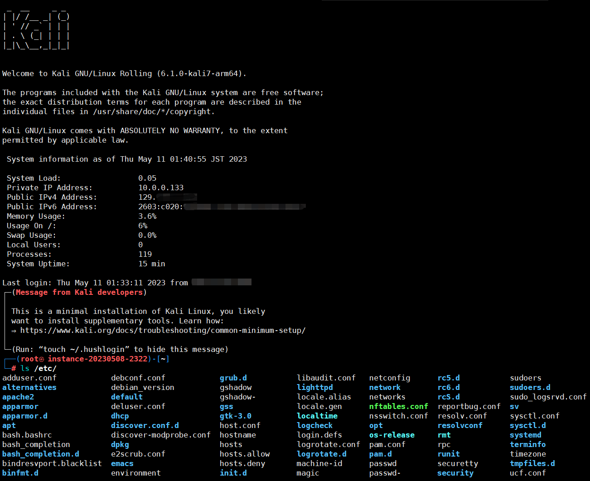

# Tools
Something about scripts
# Linux reinstall useage

## Download:
<pre><code>wget --no-check-certificate -qO InstallNET.sh 'https://raw.githubusercontent.com/leitbogioro/Tools/master/Linux_reinstall/InstallNET.sh' && chmod a+x InstallNET.sh</code></pre>

## Dependences:
Debian series(Debian / Ubuntu):
<pre><code>apt update -y</code></pre>
<pre><code>apt install wget -y</code></pre>
Redhat series(CentOS / AlmaLinux / RockyLinux / OracleLinux / Fedora / VzLinux):
<pre><code>yum install wget -y</code></pre>

## Quickly start
If you need to add other parameters, version number must be assigned!
### Debian 12
<pre><code>bash InstallNET.sh -debian</code></pre>
### CentOS 9 stream
<pre><code>bash InstallNET.sh -centos</code></pre>
### AlmaLinux 9
<pre><code>bash InstallNET.sh -almalinux</code></pre>
### RockyLinux 9
<pre><code>bash InstallNET.sh -rockylinux</code></pre>
### Fedora 38
<pre><code>bash InstallNET.sh -fedora</code></pre>
### Ubuntu 20.04
<pre><code>bash InstallNET.sh -ubuntu</code></pre>

## Fully useage sample
<pre><code>bash InstallNET.sh -debian/ubuntu/centos/almalinux/rockylinux/fedora(os type) 11(os version) -version 64(os bit) -port "your server port" -pwd "your server password" -mirror "a valid url for linux image source" -dd/--image "dd image url" -filetype "gz or xz" -timezone "like Asia/Tokyo etc" --dhcp-static/--ip-addr 'x.x.x.x'(ip address) --ip-mask 'x.x.x.x'(subnet mask) --ip-gate 'x.x.x.x'(gateway) -firmware(Debian with hardware drivers)</code></pre>

## Parameters detail descriptions
**-debian 9/10/11/12** : Debian 9 and later
 
 

**-centos 7/8/9-stream**: CentOS 7 and later
 
 

**-almalinux/alma 8/9**: AlmaLinux 8 and later
 
 

**-rockylinux/rocky 8/9**: RockyLinux 8 and later
 
 

**-fedora 34/35/36/37**: Fedora 34 and later
 
 

**-ubuntu 16.04/18.04/20.04**: Ubuntu from 16.04 to 20.04
 
 

**-mirror "a valid DIST mirror url"**: OS install files resource, you can select one which nearest for actual location of your server to upspeed installation.
 
 

For Debian, official recommend mirror lists are here:
 
<pre><code>https://www.debian.org/mirror/list.html</code></pre>
 

For CentOS 7 and 8-stream, official recommend mirror lists are here:
 
<pre><code>https://www.centos.org/download/mirrors/</code></pre>
 

For CentOS 9-stream and later, official recommend mirror lists are here:
 
<pre><code>https://admin.fedoraproject.org/mirrormanager/mirrors/CentOS</code></pre>
 

For AlmaLinux, official recommend mirror lists are here:
 
<pre><code>https://mirrors.almalinux.org/</code></pre>
 

For RockyLinux, official recommend mirror lists are here:
 
<pre><code>https://mirrors.rockylinux.org/mirrormanager/mirrors</code></pre>
 

For Fedora, official recommend mirror lists are here:
 
<pre><code>https://admin.fedoraproject.org/mirrormanager/mirrors/Fedora</code></pre>
 

For Ubuntu, official recommend mirror lists are here:
 
<pre><code>https://launchpad.net/ubuntu/+cdmirrors</code></pre>
 

**-port ""**: you can pre-specify ssh port of system, range is 1~65535, both Redhat series or Debian series could be supported, **default is '22'**.
 
 

**-pwd ''**: you can pre-specify ssh password of system, both Redhat series or Debian series could be supported, **default is 'LeitboGi0ro'**.
 
 

**-dd/--image "DD image from a valid url"**: This parameter is for DD mode in KVM or XEN virtualization platform, current os must be Debian series, for example, if you want to DD windows, you can refer to chapter "How to install Windows?" to get more in this document.
 
 

**-filetype "gz/xz"**: To determine DD file type, not only ".gz"(default) but also ".xz" can be supported.
 
 

**-timezone "like Asia/Tokyo etc"**: It means assign timezone manually, if you are using a proxy to connect to your machine and then execute "InstallNET.sh", automatic timezone configuration may not suitable for you in this situation.
 
 

**-raid "0"**: Only for raid 0 disk partition, if your machine has only one hard drive, don't assign it!
 
 

**--network "dhcp/auto" or "static/manual"**: Default to use DHCP to finish network configuration. If your cloud provider is a small or middle merchant, the network of your machine may be static so you need to add it. it is equal with add --ip-addr "" --ip-mask "" --ip-gate "", if you add this, don't distribute the following three items again! It must be added in the last of the command.
 
 

**--ip-addr "IPv4 address"**: It must be added with --ip-gate and --ip-mask together, if you have added --dhcp-static, don't assign it again!
 
 

**--ip-gate "IPv4 gateway"**: It must be added with --ip-addr and --ip-mask together, if you have added --dhcp-static, don't assign it again!
 
 

**--ip-mask "IPv4 subnet musk"**: It must be added with --ip-addr and --ip-gate together, if you have added --dhcp-static, don't assign it again!
 
 

**--ip-dns "IPv4 DNS server"**: This one is only for static network configuration and default is 1.0.0.1, you can also change other IPv4 dns server like 8.8.8.8, 9.9.9.9, 4.4.2.2 etc to replace it. If the network of your machine is DHCP, don't assign it!
 
 

**-firmware**: Specify drivers for Debian to support old hardwares, if your server location is in mainland China, program will switch to mirror of 'University of Science and Technology of China(https://mirrors.ustc.edu.cn/debian-cdimage/)' for downloading more quickly, default mirror is from http://cdimage.debian.org/cdimage/.
 
 

**-version 32/i386 or 64/amd64 or arm/arm64**: OS bit. Program will automatically detect and redirect the CPU architecture from your machine to new system which would be installed, if you aren't known it well, don't assign it!
 
 

### Advanced usage, for example Debian 12 (recommend for servers which are locating outside of mainland China)
Japan:
 
<pre><code>bash InstallNET.sh -debian 12 -mirror "http://ftp.riken.jp/Linux/debian/debian/"</code></pre>
HongKong:
 
<pre><code>bash InstallNET.sh -debian 12 -mirror "http://ftp.hk.debian.org/debian/"</code></pre>
Singapore:
 
<pre><code>bash InstallNET.sh -debian 12 -mirror "http://ftp.sg.debian.org/debian/"</code></pre>
South Korea:
 
<pre><code>bash InstallNET.sh -debian 12 -mirror "http://ftp.kddilabs.jp/pub/debian/"</code></pre>
Taiwan:
 
<pre><code>bash InstallNET.sh -debian 12 -mirror "http://ftp.tw.debian.org/debian/"</code></pre>
America:
 
<pre><code>bash InstallNET.sh -debian 12 -mirror "https://mirrors.ocf.berkeley.edu/debian/"</code></pre>
Canada:
 
<pre><code>bash InstallNET.sh -debian 12 -mirror "http://ftp.ca.debian.org/debian/"</code></pre>
Britain:
 
<pre><code>bash InstallNET.sh -debian 12 -mirror "http://ftp.uk.debian.org/debian/"</code></pre>
Germany:
 
<pre><code>bash InstallNET.sh -debian 12 -mirror "http://ftp.de.debian.org/debian/"</code></pre>
France:
 
<pre><code>bash InstallNET.sh -debian 12 -mirror "http://ftp.fr.debian.org/debian/"</code></pre>
Netherlands:
 
<pre><code>bash InstallNET.sh -debian 12 -mirror "http://ftp.nl.debian.org/debian/"</code></pre>
Switzerland:
 
<pre><code>bash InstallNET.sh -debian 12 -mirror "http://ftp.ch.debian.org/debian/"</code></pre>
Russia:
 
<pre><code>bash InstallNET.sh -debian 12 -mirror "http://ftp.ru.debian.org/debian/"</code></pre>
Australia:
 
<pre><code>bash InstallNET.sh -debian 12 -mirror "http://ftp.au.debian.org/debian/"</code></pre>

## Default configurations
### Time zone
Depends on the geo-location of guest's IP(automode) or "Asia/Tokyo"(if the format of the input parameter is incorrect or it's not supported by current operating system in manual mode)
### Default user name
root
### Default password
LeitboGi0ro
### Default port
22
 
 
<b>If you didn't assign any other ssh password or port, after system installation, you must change password(LeitboGi0ro) and ssh port(22) immediately to prevent unauthorized access!</b>
 
 

## Errors and solutions:
In some versions of CentOS 8 which are not subsumed into CentOS-stream are end of supporting by CentOS official, so the source is failure:
<pre><code>Failed to synchronize cache for repo 'baseos', ignoring this repo.
Failed to synchronize cache for repo 'appstream', ignoring this repo.</pre></code>
You first need to fix the source available and then execute this script.
<pre><code>cd /etc/yum.repos.d/
sed -i 's/mirrorlist/#mirrorlist/g' /etc/yum.repos.d/CentOS-*
sed -i 's|#baseurl=http://mirror.centos.org|baseurl=http://vault.centos.org|g' /etc/yum.repos.d/CentOS-*</pre></code>
If script notices any error like in "# Check Dependence", please execute it again!

## How to install Windows?
Notice: Microsoft products and services—including images, text, and software downloads (the "content")—are owned either by Microsoft Corporation or by third parties who have granted Microsoft permission to use the content. Microsoft cannot grant you permission for content that is owned by third parties. You may only copy, modify, distribute, display, license, or sell the content if you are granted explicit permission within the End-User License Agreement (EULA) or license terms that accompany the content or are provided in the following guidelines. For more information, consult your copyright attorney.
 
 
<b>"installNET.sh" doesn't provide any third-part activation service for Windows, this function is only help you to research, evaluate related features of Windows. "installNET.sh" is not responsible or liable if someone cause any illegal circumstance.</b>
### Servers based on KVM or XEN virtualization, Debian series only:
<pre><code>bash InstallNET.sh -dd "DD image download URL"</code></pre>
### Servers based on physical hardware, Intel network adapter, kimsufi etc:
Change netboot to rescue mode, receive mail, get temporary username and password, log into linux, execute:
<pre><code>wget -O- "DD download URL" | xzcat | dd of=/dev/sda</code></pre>
### Available Windows DD images:
#### Windows Server series from TeddySun(https://teddysun.com/):
Username: Administrator
 
Password: Teddysun.com
 
- Windows Server 2022 Datacenter

Chinese: https://dl.lamp.sh/vhd/zh-cn_win2022.xz
 
English: https://dl.lamp.sh/vhd/en-us_win2022.xz
 
Japanese: https://dl.lamp.sh/vhd/ja-jp_win2022.xz
 
- Windows Server 2019 Datacenter

Chinese: https://dl.lamp.sh/vhd/cn_win2019.xz
 
English: https://dl.lamp.sh/vhd/en_win2019.xz
 
Japanese: https://dl.lamp.sh/vhd/ja_win2019.xz
 
- Windows Server 2012 R2 Datacenter

Chinese: https://dl.lamp.sh/vhd/cn_win2012r2.xz
 
English: https://dl.lamp.sh/vhd/en_win2012r2.xz
 
Japanese: https://dl.lamp.sh/vhd/ja_win2012r2.xz

## Features and updates:
- "InstallNET.sh" will give you a clean, safe, official Linux system, and help you escape of your server providers' monitoring.
- The operation is easy, several minutes installation will be complated.
- Support install to Debian series(including Debian 8+, Ubuntu 14.04 ~ 20.04), Redhat series(including CentOS 7+, AlmaLinux 8+, RockyLinux 8+, Fedora 34+).
- Can also run in mainline version of other Redhat series(Oracle Linux 7+, VzLinux 8+) to install supported system.
- Support major cloud providers, especially support Oracle Cloud ARM machine.
- Detect the CPU architecture of current os and exchange correct architecture to new system automatically, you need not to add parameter '-version' at all to comfirm architecture manually.
- Can handle boot menuentry items automatically of grub2 in different hardware platforms(AMD64 legacy / AMD64 UEFI / ARM64 UEFI) to make sure all supported boot file can be loaded correctly.
- Support install from Linux(Debian series only) to Windows. details refer to "How to install Windows?" section.
- Support IPv6 single-stack(have only IPv6 public address and IPv4 intranet routing) server like Vultr 2.5$ monthly plan, only for DHCP.
- Support network auto configurations in bio-stack(have both IPv4 and IPv6 public address), after log into new system, you don't have to config IPv6 address manually, only for Debian, DHCP.
- You can modify architecture, mirror, firmware, ssh port, password etc. 
- Friendly to low memory device, for Debian series, recommend RAM is above 512MB, for Redhat series, recommend RAM is above 2GB.</b>
- Ubuntu 22.04 has cancelled net boot start features, so this program don't support Ubuntu 22.04 and above reinstallation, source: http://archive.ubuntu.com/ubuntu/dists/jammy/main/installer-amd64/current/legacy-images/: The Legacy Ubuntu Server Installer is no longer available, initrd.gz and linux netboot file for arm64 architecture as also.
- The Debian official mirror of South Korea http://ftp.kr.debian.org/debian/ is usually crashed down, so I changed recommend mirror as Jaist University https://www.jaist.ac.jp/index.html, for Japan is from https://www.riken.jp/, a science research organization, for America is from University of California, Berkeley: https://www.berkeley.edu/.
- Completely modified Debian, such as support terminal files colorful displaying, permanently change dns server, disable expired certificates, add on a cute welcome introduction, pre-install many complements in preseeding progress, now enjoy a newly, comfortable, graceful debian experience!
- Support grub2 boot file modify, it can switch Debian series to Redhat series or switch Redhat series to Debian series smoothly, in old version if you installed from Debian series to Redhat series, you can never switch to Debian series again.
- Support xfs file system(only for Debian 9 and later), it's better than the old ext2 and it's the default option of Redhat series, the file system of raid 0 disk partition mode is ext4.
- Detect if the machine is operating in mainland of China or outside and switch mirror automatically.
- Support the parameter of '-port' to modify ssh port of Redhat series.
- Detect the network of device is DHCP or static automatically.
- For windows DD package, default compression method is "gz", if your package is ".xz", you can add parameter -filetype "xz" to decompress it.
- Support Raid 0, to add parameter -raid "0", the validation need to be certificated.
- Disable ntp clock setup for static network in Debian/Ubuntu installation otherwise it may cause static network failed.
- Fix if input --ip-addr "" --ip-mask "" --ip-gate "", static network configuration may not valid.
- Support config timezone automatically according to the geo-location of the guest's IP or determine an existed timezone parameter to config it manually is also be supported.
- Concentrate all needed installation of dependences to inner command except "wget" because you need to download "InstallNET.sh" first.
- Change name server for Debian permanently is provided by "resolvconf", related configuration files has been written. you just need to logging in new installed system, and install "resolvconf":
<pre><code>echo "O" | apt install resolvconf -y</code></pre>
to make changes validating!
- Support Debian 12.
- Update pre-install components, python2 to python3, vim-gtk2 to vim-gtk3 for support Debian 12.
- Creat a new algorithm for checking effectiveness about IPv6, it's applied in 10-sysinfo for motd file in Debian and the main program "InstallNET.sh".
- Because of boot menuentry configuration in grub file "grub.cfg" from RockyLinux 9 of official template of Oracle Cloud is different from other standard Redhat like os(version 7+) compeletely, so I creat a new algorithm for handle this and all of similar situation in future.
- Update vim file modification for Debian 12.
- Because of github.com and githubusercontent.com etc are banned by China, so I switich external files download sources which are necessary for Debian or Redhat like os example files for motd, firewall configurations etc. If your server is in mainland of China, the external files will be downloaded from https://gitee.com/mb9e8j2/Tools/, the other country/area will also be downloaded in this depository.
- Try to enable IPv4 and IPv6 dhcp if possible.
- Add necessary annotates
- Set default installation os as Debian 12 and the value of architecture is empty instead of AMD64 because program will check architecture automatically.

## Defects:
- Not support for Ubuntu 22.04(jammy) and further versions because Canonical has deprecated the traditions which were also applied together with Debian by forcing users to download a huge several gigabytes iso image and then load it in its&apos; fuckin Cloud-init instead of just two simply a hundred megabytes total network boot files by PXE boot, it runs in QEMU environment and CPU hardware virtualization must be demanded but most of VPS can&apos;t handle it well at all. Canonical has developed into a mature commercial company which intends to earn more money from major partners so they discrimes their personal users intentionally who are low-end clients in their conceptions certainly despite these users were their devoted fans since always and helped Canonical to make great achieves today step by step. According to the behavior of discarding a large amount of former precious Debian installer preseed heritances, Canonical would play a role as a guilty dictator like Apple.Inc in more areas and then violate the spirit of the universal free software finally.
- For Redhat series 8, the minimum memory requirement is 2.5GB, for Redhat series 9, the minimum memory requirement is 2GB.
- Because the syntax of grub1 in Redhat series 6 is different from other Linux version of grub1 or grub2 completely, so I removed support to CentOS 6 and Oracle Linux 6.
- All system templates of GCP are not supported.
___

# .bashrc
.bashrc is a script file system which contains a series of configurations for the terminal session. when the user logs in. The file itself includes highlight settingup for different files.
how to use?
## Delete default .bashrc
<pre><code>rm -rf ~/.bashrc</code></pre>
## Download .bashrc and reboot your system
<pre><code>wget --no-check-certificate -qO ~/.bashrc 'https://raw.githubusercontent.com/leitbogioro/Tools/master/.bashrc' && chmod a+x .bashrc
 
 reboot</code></pre>

# GroupPolicy import and export
This ".bat" script can only run in Windows. Although only one group-policy rule in Windows can be exported at a time and not support a global one and also have no GUI entrance to import another backuped group policy which exported from another computer. It can help you import or export GroupPolicy conveniently.
## Attentions
<ul>
<li>Compatible with all versions of Windows.</li>
<li>Only support the group-policy rules which exported by this script.</li>
<li>If you want to export group-policy rules. Folder which included group-policy files corresponds to current OS version strictly. Not support export rules which is different from current OS version.</li>
<li>Export operation is irreversible, be cautious to run it！</li>
<li>I provided a suggested rules file about Windows Server 2016.</li>
<li>You should run it on desktop.</li>
</ul>
